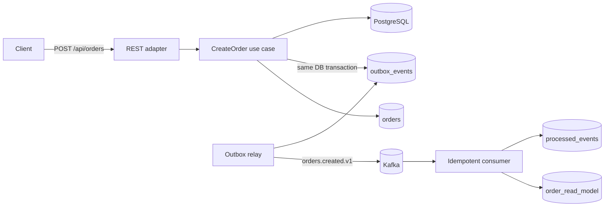

# EventFlow

**Production-style event-driven order processing platform** built to demonstrate backend engineering decisions beyond CRUD: transactional consistency, asynchronous messaging, idempotent consumers, retries, observability, testing and containerized deployment.

> Java 21 · Spring Boot 3.5 · Apache Kafka · PostgreSQL · Flyway · Testcontainers · Docker · Kubernetes

## Why this project exists

Most demo projects stop at `Controller -> Service -> Repository`. EventFlow focuses on the problems that appear once a system becomes distributed:

- How do you persist business state **and** publish an event without a dual-write bug?
- What happens when Kafka is temporarily unavailable?
- How do you make consumers safe when Kafka delivers the same message more than once?
- How do you retry without hammering dependencies forever?
- How do you expose health and metrics for production operations?

EventFlow answers those questions with concrete implementation choices that are easy to inspect and discuss in a technical interview.

## Architecture



The write path uses the **Transactional Outbox Pattern**. The HTTP request never tries to update PostgreSQL and Kafka independently. The order and its domain event are persisted in the same database transaction. A relay publishes committed outbox rows to Kafka afterwards.

The consumer stores the event ID in `processed_events` in the same transaction as its projection update. Re-delivery therefore becomes safe and effectively idempotent.

## Main engineering decisions

| Problem | Choice | Why |
|---|---|---|
| DB + Kafka dual write | Transactional outbox | Avoids losing events after a committed order |
| Kafka duplicate delivery | Inbox/idempotency table | Consumers can safely process at-least-once delivery |
| Broker outage | Persistent outbox + exponential retry | Business writes remain accepted while Kafka recovers |
| Poison events | Dead-letter topic after bounded attempts | Failed messages become observable instead of retrying forever |
| Schema evolution | Versioned topic/event name (`orders.created.v1`) | Makes compatibility explicit |
| Database evolution | Flyway migrations | Reproducible schema across environments |
| Production health | Spring Boot Actuator + Prometheus | Readiness/liveness and metrics are first-class |
| Integration confidence | Testcontainers + PostgreSQL | Tests run against the same database engine used in runtime |

## Package structure

```text
src/main/java/com/zakaria/eventflow
├── domain/
├── application/
│   ├── port/in/
│   ├── port/out/
│   └── service/
└── adapter/
    ├── in/web/
    └── out/
        ├── persistence/
        └── messaging/
```

The dependency direction is intentional: the domain does not depend on Spring, Kafka, PostgreSQL or HTTP.

## API

```bash
curl -X POST http://localhost:8080/api/orders \
  -H 'Content-Type: application/json' \
  -d '{"customerId":"customer-42","amount":129.90,"currency":"EUR"}'
```

## Run locally

Requirements: Docker + Java 21 + Maven 3.6.3+.

```bash
docker compose up -d
mvn spring-boot:run
```

Useful endpoints:

- API: `http://localhost:8080/api/orders`
- Health: `http://localhost:8080/actuator/health`
- Prometheus: `http://localhost:8080/actuator/prometheus`

## Test strategy

```bash
mvn verify
```

The integration suite uses PostgreSQL through Testcontainers and verifies the key invariant: **creating an order commits both the order and its outbox event atomically**.

## Failure scenarios worth discussing

### PostgreSQL succeeds, Kafka is down
The API transaction commits the order and outbox row. The relay retries later. No event is lost.

### Kafka acknowledges a message but the relay crashes before marking it published
The row may be sent again. Consumers are idempotent using the event ID.

### Consumer crashes after updating its projection
The projection update and `processed_events` insert share one transaction. Either both commit or neither does.

### One event repeatedly fails
The relay uses bounded exponential backoff. After the retry budget is exhausted, the message is routed to a DLT.

## Roadmap

- [x] Hexagonal package boundaries
- [x] Transactional outbox
- [x] Kafka publishing
- [x] Idempotent consumer / inbox table
- [x] Retry + DLT path
- [x] PostgreSQL + Flyway
- [x] Testcontainers integration test
- [x] Docker Compose
- [x] Kubernetes manifests
- [x] GitHub Actions CI
- [ ] OpenTelemetry traces
- [ ] Avro/Protobuf + Schema Registry
- [ ] Load test with k6
- [ ] Terraform deployment to AWS

## 30-minute interview walkthrough

1. Dual-write problem and why the outbox exists.
2. Transaction boundaries in order creation.
3. At-least-once Kafka semantics and idempotent consumption.
4. Retry/DLT behavior under failures.
5. Domain isolation from infrastructure.
6. What Testcontainers verifies.
7. Kubernetes readiness/liveness and metrics.
8. Changes needed at 10× and 100× traffic.

## License

MIT
