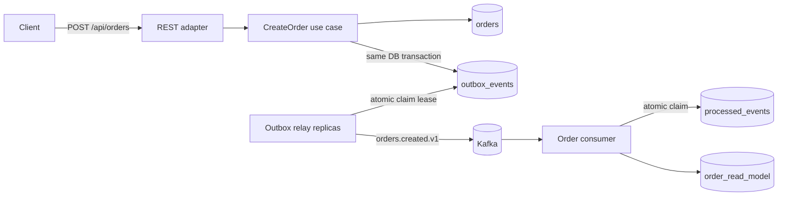

# EventFlow

**Production-style event-driven order processing platform** built to demonstrate backend engineering decisions beyond CRUD: transactional consistency, asynchronous messaging, concurrent idempotency, multi-replica work claiming, retries, observability, integration testing and containerized deployment.

> Java 21 · Spring Boot 3.5 · Apache Kafka · PostgreSQL · Flyway · Testcontainers · Micrometer/OpenTelemetry · Docker · Kubernetes

## Why this project exists

Most demo projects stop at `Controller -> Service -> Repository`. EventFlow focuses on the problems that appear once a system becomes distributed:

- How do you persist business state **and** publish an event without a dual-write bug?
- What happens when Kafka is temporarily unavailable?
- How do multiple relay replicas avoid publishing the same pending row concurrently?
- How do you recover work claimed by a relay pod that crashes?
- How do you make consumers safe when Kafka delivers the same message more than once — even concurrently?
- How do you retry without hammering dependencies forever?
- How do you prove the asynchronous path against real PostgreSQL and Kafka instances?
- How do you expose health, metrics and traces for production operations?

EventFlow answers those questions with concrete implementation choices that are easy to inspect and discuss in a technical interview.

## Architecture



The write path uses the **Transactional Outbox Pattern**. The HTTP request never tries to update PostgreSQL and Kafka independently. The order and its domain event are persisted in the same database transaction. A relay publishes committed outbox rows to Kafka afterwards.

Before publishing, each relay atomically claims a batch with PostgreSQL `FOR UPDATE SKIP LOCKED` and stores `claimed_by` / `claimed_until`. The database transaction ends **before** the Kafka network call. Other replicas skip locked rows during the claim and ignore active leases afterwards. If a pod dies, its rows become eligible again when the lease expires.

The consumer does not use a vulnerable `exists -> insert` sequence. It atomically claims an event with PostgreSQL `INSERT ... ON CONFLICT DO NOTHING`, then updates the projection in the **same transaction**. Duplicate delivery therefore remains safe even when duplicates arrive concurrently.

## Main engineering decisions

| Problem | Choice | Why |
|---|---|---|
| DB + Kafka dual write | Transactional outbox | Avoids losing an event after a committed order |
| Concurrent relay replicas | `FOR UPDATE SKIP LOCKED` + persisted claim lease | Shares pending work without holding DB locks during Kafka calls |
| Relay crash after claiming work | Expiring `claimed_until` lease | Abandoned rows automatically become eligible again |
| Kafka duplicate delivery | Atomic inbox claim | Removes the check-then-act race under concurrent duplicate delivery |
| Consumer failure after claim | Claim + projection in one transaction | A failed projection rolls the claim back so Kafka can retry |
| Broker outage | Persistent outbox + exponential retry | Business writes remain accepted while Kafka recovers |
| Poison publication | Dead-letter topic after bounded attempts | Repeated publish failures become observable instead of retrying forever |
| Schema evolution | Versioned topic/event name (`orders.created.v1`) | Makes compatibility explicit |
| Database evolution | Flyway migrations | Reproducible schema across environments |
| Production health | Spring Boot Actuator + Prometheus | Readiness/liveness and metrics are first-class |
| Tracing hooks | Micrometer Observation + OpenTelemetry bridge | Business async stages create explicit observations without coupling domain code to a tracing vendor |
| Integration confidence | Testcontainers PostgreSQL + Kafka | Tests exercise the same infrastructure categories used at runtime |

## Package structure

```text
src/main/java/com/zakaria/eventflow
├── domain/
├── application/
│   ├── port/in/
│   ├── port/out/
│   └── service/
└── adapter/
    ├── in/web/
    └── out/
        ├── persistence/
        └── messaging/
```

The dependency direction is intentional: the domain does not depend on Spring, Kafka, PostgreSQL, HTTP or OpenTelemetry.

## API

```bash
curl -X POST http://localhost:8080/api/orders \
  -H 'Content-Type: application/json' \
  -d '{"customerId":"customer-42","amount":129.90,"currency":"EUR"}'
```

## Run locally

Requirements: Docker + Java 21 + Maven 3.6.3+.

```bash
docker compose up -d
mvn spring-boot:run
```

Useful endpoints:

- API: `http://localhost:8080/api/orders`
- Health: `http://localhost:8080/actuator/health`
- Prometheus: `http://localhost:8080/actuator/prometheus`

## Observability

EventFlow creates explicit Micrometer observations around:

- `eventflow.outbox.publish`
- `eventflow.order.projection`

These observations become metrics and, when tracing export is enabled, OpenTelemetry spans.

OTLP export is intentionally **disabled by default** so local development and CI do not depend on an external collector. To export traces to an OTLP-compatible collector:

```bash
OTEL_TRACING_ENABLED=true \
OTEL_EXPORTER_OTLP_ENDPOINT=http://localhost:4318/v1/traces \
TRACING_SAMPLING_PROBABILITY=1.0 \
mvn spring-boot:run
```

### Current tracing boundary

The HTTP request, outbox relay and consumer projection are observable, but the original trace context is not yet persisted inside the transactional outbox and restored as Kafka headers. Therefore EventFlow does **not** claim a single continuous distributed trace across the database-backed asynchronous boundary yet. Propagating trace context through the outbox is intentionally tracked as a future improvement.

## Test strategy

```bash
mvn verify
```

The test suite covers different failure boundaries instead of relying on one oversized test:

### Domain/unit tests
Validate order invariants and use-case behavior without infrastructure.

### `OrderOutboxIT`
Starts PostgreSQL with Testcontainers and proves the critical synchronous invariant: **the order and its outbox event are committed together**.

### `OrderPipelineIT`
Starts both PostgreSQL and Kafka with Testcontainers and verifies the real asynchronous path:

```text
CreateOrder
  -> orders + outbox_events
  -> claim lease
  -> scheduled outbox relay
  -> Kafka
  -> consumer
  -> processed_events
  -> order_read_model
```

It also verifies that the outbox lease is released after successful publication.

### `OrderProjectionIdempotencyIT`
Dispatches the **same event concurrently from 8 workers** and verifies that the database contains exactly one processed-event claim and one projection.

This test specifically protects against the classic `exists -> insert` race.

### `OutboxClaimIT`
Creates six pending events and launches two claim workers concurrently. The test verifies that their batches are disjoint, all six rows receive leases, an immediate extra worker finds no eligible work, and expired leases can be reclaimed after a simulated relay crash.

## Failure scenarios worth discussing

### PostgreSQL succeeds, Kafka is down
The API transaction commits the order and outbox row. The relay retries later. No event is lost.

### Two relay pods poll the same pending queue
Each worker claims rows using one atomic PostgreSQL statement. `FOR UPDATE SKIP LOCKED` separates concurrent claim transactions and the persisted lease prevents a second worker from taking already-claimed rows after the first transaction commits.

### Relay crashes after claiming but before publishing
The claim remains unavailable only until `claimed_until`. Once the lease expires, another replica can reclaim the event.

### Kafka acknowledges a message but the relay crashes before marking it published
The row may be sent again after its lease expires. The consumer's event-ID claim makes re-delivery safe. EventFlow intentionally provides **at-least-once**, not magical exactly-once business delivery.

### Two consumers receive the same event concurrently
Both attempt the same atomic PostgreSQL claim. Only one transaction obtains the event ID; the other performs no projection work.

### Consumer crashes while building its projection
The `processed_events` claim and projection update share one transaction. Either both commit or both roll back.

### One event repeatedly fails to publish
The relay uses bounded exponential backoff. After the retry budget is exhausted, the event is routed to a DLT.

## Architecture Decision Records

- [`ADR-0001`](docs/adr/0001-transactional-outbox.md) — Transactional outbox for DB/Kafka consistency
- [`ADR-0002`](docs/adr/0002-atomic-consumer-idempotency.md) — Atomic consumer idempotency claim
- [`ADR-0003`](docs/adr/0003-outbox-claim-lease.md) — Multi-replica outbox claiming with `SKIP LOCKED` and leases

## Roadmap

- [x] Hexagonal package boundaries
- [x] Transactional outbox
- [x] Kafka publishing
- [x] Atomic idempotent consumer / inbox claim
- [x] Multi-instance outbox claiming with `SKIP LOCKED` + lease recovery
- [x] Retry + DLT path
- [x] PostgreSQL + Flyway
- [x] PostgreSQL Testcontainers integration test
- [x] Kafka Testcontainers end-to-end integration test
- [x] Concurrent duplicate-delivery integration test
- [x] Concurrent outbox-claim integration test
- [x] Prometheus metrics
- [x] Micrometer/OpenTelemetry tracing hooks
- [x] Docker Compose
- [x] Kubernetes manifests
- [x] GitHub Actions CI
- [ ] Propagate trace context through the transactional outbox and Kafka headers
- [ ] Avro/Protobuf + Schema Registry
- [ ] Load test with k6
- [ ] Outbox cleanup/retention policy
- [ ] Terraform deployment to AWS

## 30-minute interview walkthrough

1. Dual-write problem and why the outbox exists.
2. Transaction boundaries in order creation.
3. Why relay replicas use a short `SKIP LOCKED` claim transaction plus a persisted lease instead of holding row locks across Kafka calls.
4. At-least-once Kafka semantics and why transport-level "exactly once" is not the business guarantee.
5. Why `exists -> insert` is racy and how the atomic consumer claim fixes it.
6. Retry/DLT behavior under failures.
7. Domain isolation from infrastructure.
8. What each Testcontainers test proves — and what it does not prove.
9. Observability boundaries and why trace propagation through an outbox needs explicit design.
10. Kubernetes readiness/liveness, Prometheus metrics and changes needed at 10× / 100× traffic.

## License

MIT
