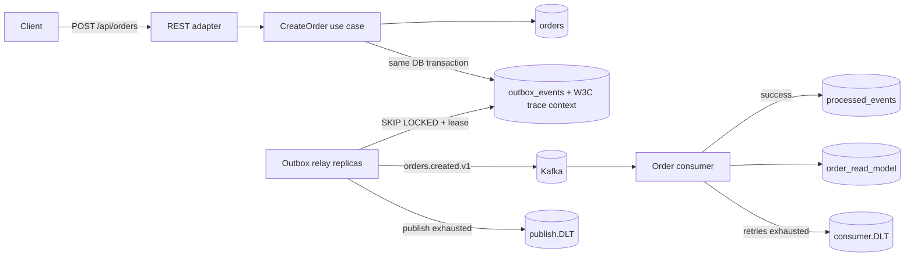

# EventFlow

**Production-style event-driven order processing platform** built to demonstrate backend engineering decisions beyond CRUD: transactional consistency, asynchronous messaging, concurrent idempotency, multi-replica work claiming, bounded retries, dead-letter recovery, distributed tracing, integration testing and containerized deployment.

> Java 21 · Spring Boot 3.5 · Apache Kafka · PostgreSQL · Flyway · Testcontainers · Micrometer/OpenTelemetry · Docker · Kubernetes

## Why this project exists

Most demo projects stop at `Controller -> Service -> Repository`. EventFlow focuses on the problems that appear once a system becomes distributed:

- How do you persist business state **and** publish an event without a dual-write bug?
- What happens when Kafka is temporarily unavailable?
- How do multiple relay replicas avoid publishing the same pending row concurrently?
- How do you make consumers safe under duplicate delivery?
- What happens when a Kafka record is permanently unprocessable?
- How do you preserve one trace when an event waits in PostgreSQL before Kafka sees it?
- How do you prove those guarantees against real infrastructure rather than mocks?

## Architecture



The write path uses the **Transactional Outbox Pattern**. The HTTP request never tries to update PostgreSQL and Kafka independently. The order and its domain event are persisted in the same database transaction; publication happens afterwards.

Before publishing, each relay atomically claims work using PostgreSQL `FOR UPDATE SKIP LOCKED` plus an expiring lease. The claim transaction ends before the Kafka network call, allowing multiple Kubernetes replicas to share work without holding database locks across broker latency.

The W3C trace carrier is persisted with the outbox row and restored before the relay publish observation. Spring Kafka producer/listener observations propagate that trace through Kafka headers, so the delayed asynchronous path can remain part of the same distributed trace.

The consumer uses PostgreSQL `INSERT ... ON CONFLICT DO NOTHING` as an atomic inbox claim and writes its projection in the same transaction. Concurrent duplicate deliveries therefore create one projection.

Permanent consumer failures have a separate recovery path: after bounded retries, Spring Kafka publishes the original record to `orders.created.v1.consumer.DLT`. This is intentionally separate from `orders.created.v1.publish.DLT`, which represents failures in the outbox publication stage.

## Main engineering decisions

| Problem | Choice | Why |
|---|---|---|
| DB + Kafka dual write | Transactional outbox | Avoids losing an event after a committed order |
| Concurrent relay replicas | `FOR UPDATE SKIP LOCKED` + claim lease | Shares work without holding DB locks during Kafka calls |
| Relay crash after claim | Expiring `claimed_until` | Abandoned rows automatically become eligible again |
| Trace broken by DB-backed async boundary | Persist + restore W3C trace carrier | Preserves business trace identity across time/threads/replicas |
| Kafka duplicate delivery | Atomic inbox claim | Removes the concurrent `exists -> insert` race |
| Consumer failure after claim | Claim + projection in one DB transaction | Failure rolls both back so Kafka can retry safely |
| Transient consumer failure | Bounded `DefaultErrorHandler` retries | Gives short-lived failures another chance |
| Poison consumer record | Dedicated `consumer.DLT` | Prevents infinite retry and preserves diagnostics |
| Relay publication exhaustion | Separate `publish.DLT` | Keeps publisher and consumer failure domains distinguishable |
| Broker outage | Persistent outbox + exponential retry | Business writes remain durable while Kafka recovers |
| Schema evolution | Versioned event/topic name | Makes compatibility explicit |
| Database evolution | Flyway | Reproducible schema across environments |
| Production operations | Actuator + Prometheus + OpenTelemetry | Health, metrics and traces are first-class |
| Integration confidence | Testcontainers PostgreSQL + Kafka | Tests exercise runtime infrastructure categories |

## Package structure

```text
src/main/java/com/zakaria/eventflow
├── domain/
├── application/
│   ├── port/in/
│   ├── port/out/
│   └── service/
└── adapter/
    ├── in/web/
    └── out/
        ├── persistence/
        └── messaging/
```

The domain does not depend on Spring, Kafka, PostgreSQL, HTTP or OpenTelemetry. Infrastructure concerns remain in adapters.

## API

```bash
curl -X POST http://localhost:8080/api/orders \
  -H 'Content-Type: application/json' \
  -d '{"customerId":"customer-42","amount":129.90,"currency":"EUR"}'
```

## Run locally

Requirements: Docker + Java 21 + Maven 3.6.3+.

```bash
docker compose up -d
mvn spring-boot:run
```

Useful endpoints:

- API: `http://localhost:8080/api/orders`
- Health: `http://localhost:8080/actuator/health`
- Prometheus: `http://localhost:8080/actuator/prometheus`

## Observability

EventFlow creates explicit observations around:

- `eventflow.outbox.publish`
- `eventflow.order.projection`
- Spring Kafka producer spans
- Spring Kafka listener spans

The outbox stores the W3C `traceparent` / `tracestate` carrier. The relay restores it from a fresh OpenTelemetry root context before its publish observation, preventing a scheduler span from accidentally becoming the business parent.

OTLP export is disabled by default so local development and CI do not depend on a collector:

```bash
OTEL_TRACING_ENABLED=true \
OTEL_EXPORTER_OTLP_ENDPOINT=http://localhost:4318/v1/traces \
TRACING_SAMPLING_PROBABILITY=1.0 \
mvn spring-boot:run
```

Application baggage propagation is not implemented yet.

## Test strategy

```bash
mvn verify
```

### `OrderOutboxIT`
PostgreSQL Testcontainers proves the synchronous invariant: **order + outbox event commit together**.

### `OrderPipelineIT`
PostgreSQL + Kafka Testcontainers verifies:

```text
CreateOrder
  -> orders + outbox_events
  -> claim lease
  -> relay
  -> Kafka
  -> consumer
  -> processed_events
  -> order_read_model
```

It also checks that the lease is released after successful publication.

### `OrderProjectionIdempotencyIT`
Dispatches the **same event concurrently from 8 workers** and requires exactly one processed-event claim and one projection.

### `OutboxClaimIT`
Launches two claim workers concurrently and proves disjoint batches plus recovery of expired leases.

### `OutboxTraceContextIT`
Creates a real Micrometer parent span, persists an event under it, restores the stored carrier later and verifies that the same trace ID becomes current again.

### `ConsumerDltIT`
Publishes malformed JSON to the real Kafka topic. The listener exhausts its retry budget, the original key/payload arrives in `orders.created.v1.consumer.DLT` with Spring Kafka failure metadata, and no read-model projection is created.

## Failure scenarios worth discussing

### PostgreSQL succeeds, Kafka is down
The order and outbox row remain committed. The relay retries later; the business event is not lost.

### Two relay pods poll the same queue
`SKIP LOCKED` separates concurrent claims and the persisted lease prevents another replica from immediately reclaiming committed work.

### A relay dies after claiming
The event becomes eligible again after `claimed_until` expires.

### Kafka acknowledges, then the relay dies before `published_at`
The event may be sent again after lease expiry. EventFlow intentionally provides **at-least-once delivery** and relies on consumer idempotency for correctness.

### A valid event is delivered twice concurrently
Only one consumer transaction wins the atomic inbox claim; one projection is written.

### A consumer receives malformed or permanently invalid data
The record is retried a bounded number of times, then moved to the **consumer DLT** with failure metadata. The normal projection remains untouched.

### The relay itself repeatedly cannot publish
That is a different failure domain and uses the **publish DLT**, keeping operational triage separate from consumer poison records.

## Architecture Decision Records

- [`ADR-0001`](docs/adr/0001-transactional-outbox.md) — Transactional outbox for DB/Kafka consistency
- [`ADR-0002`](docs/adr/0002-atomic-consumer-idempotency.md) — Atomic consumer idempotency claim
- [`ADR-0003`](docs/adr/0003-outbox-claim-lease.md) — Multi-replica outbox claiming with leases
- [`ADR-0004`](docs/adr/0004-outbox-trace-context.md) — W3C trace propagation across the outbox
- [`ADR-0005`](docs/adr/0005-consumer-dead-letter-policy.md) — Bounded consumer retries and dedicated DLT

## Roadmap

- [x] Hexagonal package boundaries
- [x] Transactional outbox
- [x] Multi-instance outbox claiming + lease recovery
- [x] Kafka publishing
- [x] Atomic idempotent consumer
- [x] Separate publisher/consumer dead-letter paths
- [x] Consumer poison-message retry/DLT policy
- [x] PostgreSQL + Flyway
- [x] PostgreSQL + Kafka Testcontainers coverage
- [x] Concurrent duplicate-delivery test
- [x] Concurrent outbox-claim test
- [x] W3C trace propagation through outbox + Kafka
- [x] Prometheus metrics + OpenTelemetry tracing
- [x] Docker Compose
- [x] Kubernetes manifests
- [x] GitHub Actions CI
- [ ] Avro/Protobuf + Schema Registry
- [ ] Outbox / inbox cleanup and retention policy
- [ ] Load testing with k6
- [ ] Harden outbox claim ownership against stale workers
- [ ] Terraform deployment to AWS

## 30-minute interview walkthrough

1. Dual-write problem and transactional outbox.
2. Transaction boundaries in order creation.
3. Multi-replica claim leases and why Kafka calls happen outside DB transactions.
4. W3C trace propagation across a database-backed async boundary.
5. At-least-once semantics and consumer idempotency.
6. Why `exists -> insert` is unsafe under concurrent delivery.
7. Publisher failure vs consumer poison-message failure and why they use separate DLTs.
8. What each Testcontainers test proves — and what it does not prove.
9. Kubernetes readiness/liveness, metrics and traces.
10. What changes at 10× and 100× traffic.

## License

MIT
